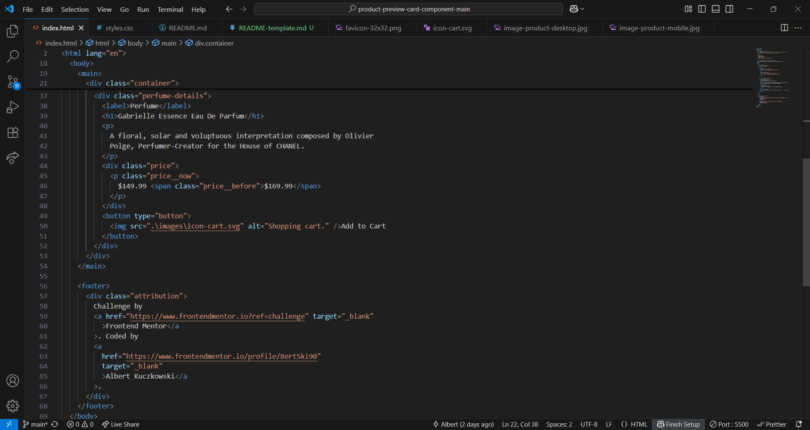

# Frontend Mentor - Product preview card component solution

This is a solution to the [Product preview card component challenge on Frontend Mentor](https://www.frontendmentor.io/challenges/product-preview-card-component-GO7UmttRfa). Frontend Mentor challenges help you improve your coding skills by building realistic projects.

## Table of contents

- [Overview](#overview)
  - [The challenge](#the-challenge)
  - [Screenshot](#screenshot)
  - [Links](#links)
- [My process](#my-process)
  - [Built with](#built-with)
  - [What I learned](#what-i-learned)
  - [Continued development](#continued-development)
  - [Useful resources](#useful-resources)
- [Author](#author)
- [Acknowledgments](#acknowledgments)

## Overview

### The challenge

Users should be able to:

- View the optimal layout depending on their device's screen size
- See hover and focus states for interactive elements

### Screenshot


HTML




CSS


### Links

- Solution URL: [Github - @BertSki90](https://github.com/BertSki90/product-preview-card-component)
- Live Site URL: [Github Pages - @BertSki90](https://bertski90.github.io/product-preview-card-component/)

## My process

### Built with

- Semantic HTML5 markup
- CSS custom properties
- Flexbox
- Mobile-first workflow

### What I learned

Completion time: 6.5 hours.

I practiced using rem and em units where appropriate. I utilized margin-inline-start and end instead of margin-left and right.

I learnt how to use media querries for various screen sizes.

```css
/* |||| MEDIA QUERRIES |||| */

/* TABLET SCREEN OR BIGGER */
@media screen and (min-width: 599px) {
  /* code */
}
```

I got the image to change to a different file depending on the screen size.

```html
<picture>
  <source
    media="(min-width:599px)"
    srcset=".\images\image-product-desktop.jpg"
  />
  
</picture>
```

### Continued development

I had a little trouble getting the height of the image to be of proper size when I was in the tablet screen size. I still need more practice writing HTML and CSS.

### Useful resources

I used a lot of the information from the Frontend Mentor learning path links. These are great help!

## Author

- Website - [Github @BertSki90](https://bertski90.github.io/product-preview-card-component/)
- Frontend Mentor - [@BertSki90](https://www.frontendmentor.io/profile/BertSki90)
- Twitter - [@BertSki90](https://x.com/BertSki90)

## Acknowledgments

Kevin Powell has an excellent course on CSS that is free. His one month course helped take what I have learnt and propel it to the next level. Thank you!
